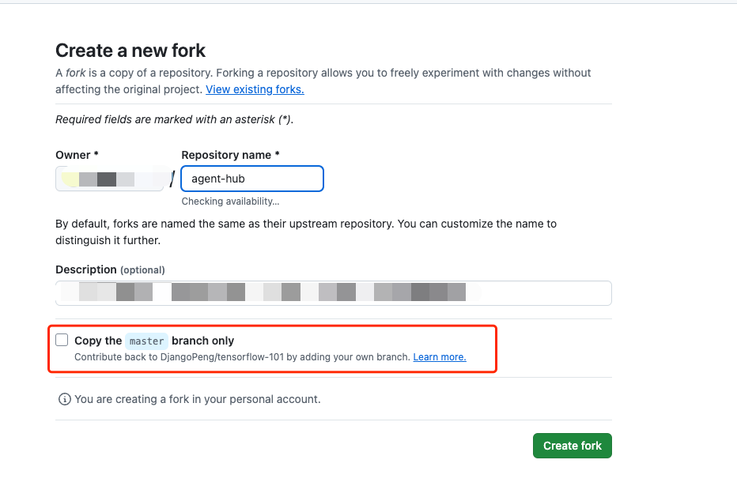
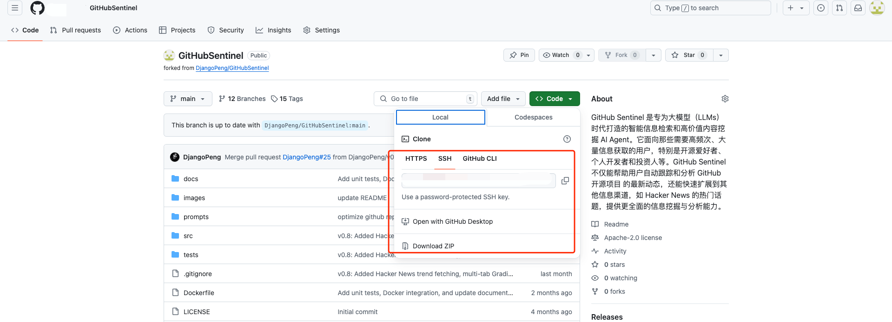
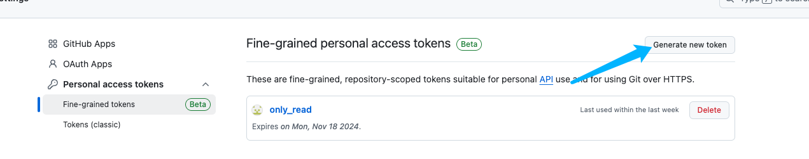
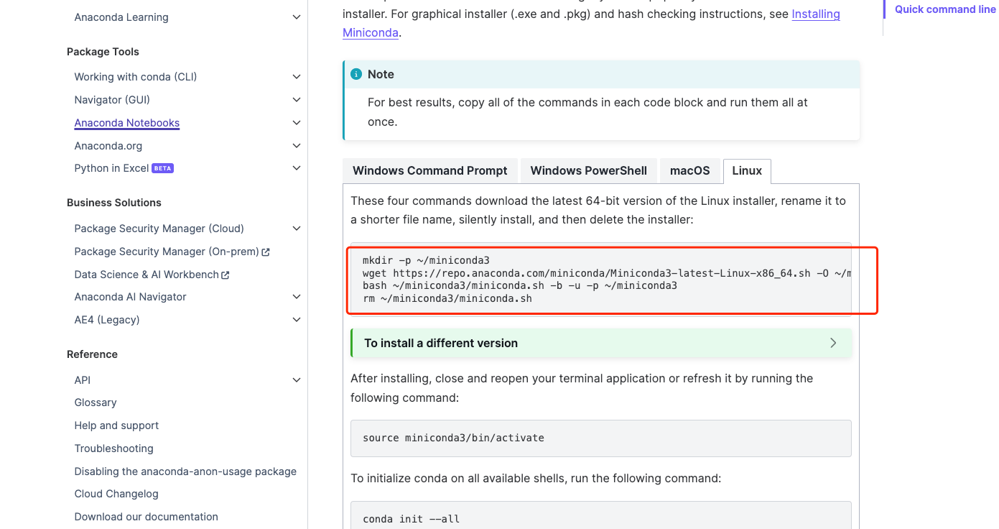
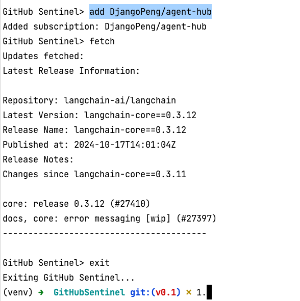

# 作业地址
https://u.geekbang.org/lesson/656?article=801641

# 作业描述
1.Star & Clone & Fork 课程项目：agent-hub（ https://github.com/DjangoPeng/agent-hub ） 与 GitHubSentinel（ https://github.com/DjangoPeng/GitHubSentinel ） ，并成功运行 GitHubSentinel v0.1 版本。

2.参考 ChatGPT 对话历史《GitHub AI Agent Strategy》（ https://chatgpt.com/share/5236d6bb-334d-4670-bc6d-918276490599 ）。新建一个 ChatGPT 聊天对话，实现类似的研发计划表和版本排期。

3.参考 ChatGPT 对话历史《GitHub Sentinel 技术实现》 （ https://chatgpt.com/share/d9b4c3f3-2594-4541-a4a6-e13b3d505ffa ）。 新建一个 ChatGPT 聊天对话，实现 GitHub Sentinel v0.0.1 版本近似功能。

作业提交方式：将对话记录通过 ChatGPT 生成分享链接，然后将链接复制粘贴到下方的作业提交框内提交即可。

# 作业1
## 如何如何完整fork项目
1. 打开项目地址, eg: https://github.com/DjangoPeng/agent-hub
2. 点击右上角的Fork按钮, 移除只复制master

3. 等待fork完成, 会跳转到自己的仓库, 并使用git clone/download 复制到你的本地

4. 也可以不处理3的步骤, 直接访问项目https://github.com/DjangoPeng/agent-hub, 选择Code, 然后选择Download ZIP/git clone 
ps: 如果没有选择完整的fork, 或者不是clone原始项目, 则会导致只有master分支,没有tag信息.
## 切换tag
根据要求切换到v0.1版本
```shell
git checkout v0.1
```
## 获取github token
1. 没有github优先注册一个
2. 进入设置进行token生成 https://github.com/settings/tokens?type=beta

3. 其他选项默认即可.生成完毕之后记得复制.

## 配置config.json
打开config.json并配置其中的github_token

## 确认环境.
- python环境使用python3.10 - 3.11. 如果不知道如何安装环境, 
```
见: https://github.com/DjangoPeng/openai-quickstart 搭建开发环境中的: Python 环境管理 Miniconda
https://docs.conda.io/projects/miniconda/en/latest/
```


## 运行
```shell
pip install -r requirements.txt
```

## 运行
```shell
python src/main.py
# 以次输入下述内容
# add DjangoPeng/agent-hub
# fetch
# 可以直接fetch 默认会因为DjangoPeng/agent-hub没有release失败, 但是 subscriptions.json中有配置了langchain-ai/langchain
# 会拿到langchain-ai/langchain的内容
```
需要查看到诸如下图的结果


# 作业2
略, 主要是模仿老师的对话进行项目开发和引导.体现过程即可.

# 作业3
略, 主要是通过对话来引导chatgpt实现功能, 体现过程即可.

第一部分可以直接要求诸如实现如下的releases功能即可.
只要实现如下述接口的获取github的对应repo的最新release即可.
github api文档位置: https://docs.github.com/en/rest/releases/releases?apiVersion=2022-11-28#get-the-latest-release
eg: 如下代码
```python
import requests

class GitHubClient:
    def __init__(self, token):
        self.token = token
    
    def fetch_updates(self, subscriptions):
        headers = {
            'Authorization': f'token {self.token}'
        }
        updates = {}
        for repo in subscriptions:
            url = f'https://api.github.com/repos/{repo}/releases/latest'
            print(url)
            response = requests.get(f'https://api.github.com/repos/{repo}/releases/latest', headers=headers)
            print(response.text)
            if response.status_code == 200:
                updates[repo] = response.json()
        return updates

    def list_releases(self, subscriptions):
        headers = {
            'Authorization': f'token {self.token}'
        }
        releases = {}
        for repo in subscriptions:
            url = f'https://api.github.com/repos/{repo}/releases'
            response = requests.get(url, headers=headers)
            if response.status_code == 200:
                releases[repo] = response.json()
        return releases


if __name__ == '__main__':
    token = "你的github token"
    client = GitHubClient(token)
    updates = client.list_releases(['langchain-ai/langchain'])
    print(updates)
```
