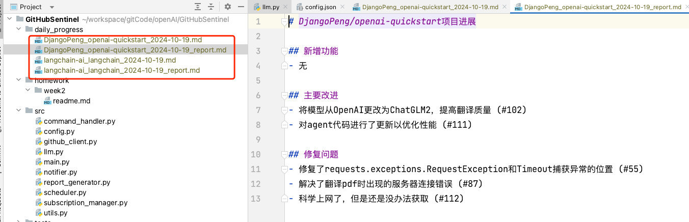

# 2.1作业
链接: https://u.geekbang.org/lesson/656?article=802459

# 2.1作业说明
2.1.1（需要提交）与 ChatGPT 深度对话，尝试使用 System role 提升报告质量和稳定性。fork 项目代码仓库（ https://github.com/DjangoPeng/GitHubSentinel ）之后修改里面的 llm.py 文件，修改好之后同步到自己 fork 后的仓库，然后在下方的作业提交框内提交 fork 后的仓库链接即可。

2.1.2（可选，不需要提交）尝试扩展 GitHubClient，使其支持 Since + Until 参数的特定时间段筛选。


# 2.1.1作业案例
主要是针对 src/llm.py的改造.使用system role 进行修改.
设置system角色.
同时使用基础的RTF+few-shot/one-shot模板进行改造.
```code
# src/llm.py

import os
from openai import OpenAI

class LLM:
    def __init__(self, open_ai_client=None):
        # 支持外部传入client，用于测试
        if open_ai_client is not None:
            self.client = open_ai_client
        else:
            self.client = OpenAI()
        # 包含最基础的RTF模板
        # R: 表示角色
        # T: 表示Task 任务
        # F: 表示格式. 其中的内容可以参考Markdown的格式. 再使用few-shot 等方式给出eg
        self.system_prompt = """
            Role: 你是一个擅长开源项目管理的GitHub Sentinel机器人。
            Task: 你的任务是根据开源项目的最新进展，生成一份简报，以便让团队了解项目的最新动态。
                  用户给你的内容包含了包括commits/issues/pull requests等。
                  你需要根据这些信息，总结一个中文的报告，以项目名称开头，包含"新增功能"、"主要改进"，"修复问题“三个板块。
            Format: 你需要生成**Markdown**格式简报, 格式如下:
            ```
             # [组织] /[仓库名]项目进展
             ## 新增功能
             - [功能描述] (#issue_number)
             - [功能描述] (#issue_number)
             ## 主要改进
             - [改进描述] (#issue_number)
             - [改进描述] (#issue_number)
             ## 修复问题
             - [问题描述] (#issue_number)
             - [问题描述] (#issue_number)
            ```
            请参考下述输出案例:
            ```
             # DjangoPeng/openai-quickstart项目进展
             ## 新增功能
             - 新增作业提交自动对话10次的功能 (#98)
             - 为 openai-translator 添加中文注释 (#60)
             ## 主要改进
             - 将模型从OpenAI更改为ChatGLM2，提高翻译质量 (#102)
             - 对agent代码进行了更新以优化性能 (#111)
             ## 修复问题
             - 修复了requests.exceptions.RequestException和Timeout捕获异常的位置 (#55)
             - 解决了翻译pdf时出现的服务器连接错误 (#87)
            ```
         """

    def generate_daily_report(self, markdown_content, dry_run=False):
        prompt = f"以下是项目的最新进展，{markdown_content}, 请生成简报"
        if dry_run:
            with open("daily_progress/prompt.txt", "w+") as f:
                f.write(prompt)
            return "DRY RUN"

        print("Before call GPT")
        response = self.client.chat.completions.create(
            model="gpt-3.5-turbo",
            messages=[
                {"role": "system", "content": self.system_prompt},
                {"role": "user", "content": prompt}
            ]
        )
        print("After call GPT")
        print(response)
        return response.choices[0].message.content

```
执行完结果
