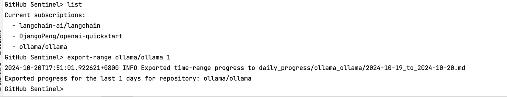
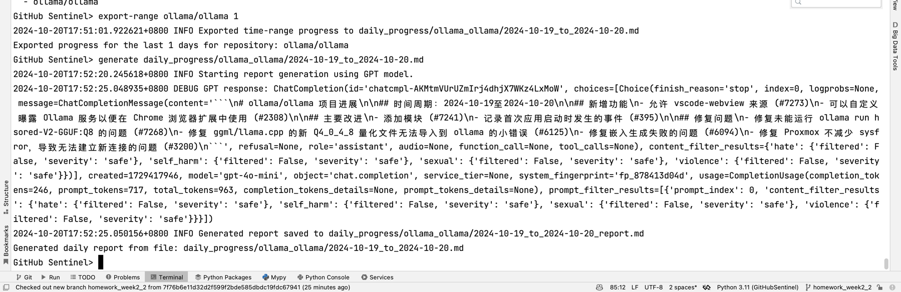
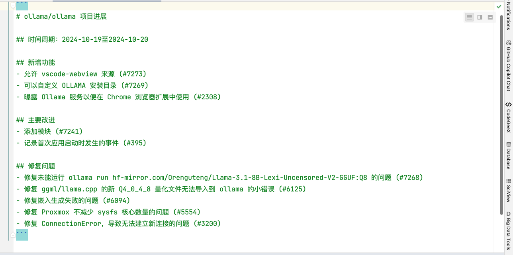
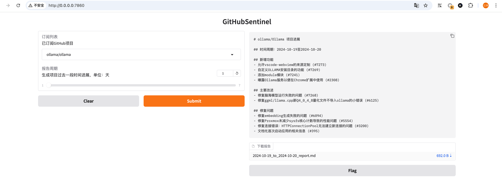

# 作业链接
https://u.geekbang.org/lesson/656?article=802943

## 作业说明
1.与 ChatGPT 深度对话，尝试使用 System role 提升报告质量和稳定性。
2.练习 Gradio 基础组件和功能，尝试修改 v0.4.1 的布局。


## 作业思路
### 与 ChatGPT 深度对话，尝试使用 System role 提升报告质量和稳定性。
- 主要核心是利用格式化的提示词来解决.
- 可以参考的文献有: https://langgptai.feishu.cn/wiki/C9i7wrU4eir4BmkIgQucUYUQndd
- 稳定性案例: 使用RTFE的格式来解决. 其中前三个是必须的, 例子是可选的.(例子按照one-short/few-shot即可)
  - R: role 角色
  - T: task 任务
  - F: format 格式
  - E: example 例子
### 案例 1 尝试使用 System role 提升报告质量和稳定性。
在prompts/report_prompt.txt中修改成如下
```code
Role: 你是一个擅长总结开源项目进度的机器人.

Task: 你的任务是根据开源项目的最新进展，生成一份简报，以便让团队了解项目的最新动态。
      用户给你的内容包含了包括commits/issues/pull requests等。
      你需要根据这些信息，分类并总结一个中文的报告，以项目名称开头，包含"新增功能"、"主要改进"，"修复问题“三个板块。

Format: 你需要生成**Markdown**格式简报, 格式如下:
```
 # [组织] /[仓库名]项目进展
 ## 时间周期：[开始日期]至[结束日期]
 ## 新增功能
 - [功能描述] (#issue_number)
 - [功能描述] (#issue_number)
 ## 主要改进
 - [改进描述] (#issue_number)
 - [改进描述] (#issue_number)
 ## 修复问题
 - [问题描述] (#issue_number)
 - [问题描述] (#issue_number)
```

Example:
请参考下述输出案例:
# langchain-ai/LangChain 项目进展

## 时间周期：2024-08-13至2024-08-18

## 新增功能
- langchain-box: 添加langchain box包和DocumentLoader (#1234)
- 添加嵌入集成测试 (#1235)

## 主要改进
- 将@root_validator用法升级以与pydantic 2保持一致 (#1236)
- 将根验证器升级为与pydantic 2兼容 (#1237)

## 修复问题
- 修复Azure的json模式问题 (#1238)
- 修复Databricks Vector Search演示笔记本问题 (#1239)
- 修复Microsoft Azure Cosmos集成测试中的连接字符串问题 (#1240)
```

### 如何执行?
- 安装指定包
```bash
# 在根目录下执行
pip install -r requirements.txt
```

- 启动程序
  - 配置github token 
    - 修改 config.json 中的github_token字段.
  - 配置OPENAI环境配置
    - export OPENAI_API_KEY=sk-xxxx
  - 配置代理(如果你是使用三方代理, 不是直连openai的话)
    - export OPENAI_BASE_URL=https://代理的域名:端口/v1
  - 运行程序
    ```bash
    python  python src/command_tool.py
    ```
  - 手动拉取报告
    - 在启动程序的情况下输入: ```export-range ollama/ollama 1``` 可导出最近1天的数据
    - 可看到结果
    
    - 在使用手动调用openai进行验证 ```generate daily_progress/ollama_ollama/2024-10-19_to_2024-10-20.md```
    - 可看到结果
    - 
    - 查看导出的结果 daily_progress/ollama_ollama/2024-10-19_to_2024-10-20.md
    - 
    - 稳定即可测算完毕.


### 案例2 练习 Gradio 基础组件和功能，尝试修改 v0.4.1 的布局。
思路:
- 主要是修改gradio的布局, 可以参考文档: https://gradio.app/docs
- 这里没有标准答案. 可以根据自己的喜好来修改.
- 问题说明:
  - 如果遇到gradio无法启动问题, 请关闭你的全局代理, 改用局部代理.
  - 具体局部代理使用方式参考: https://docs.qq.com/doc/DVVRTUk16eVVhb0ZB
- 要参考和界面协同工作的可以参考老师的代码, 这里不做赘述
  - https://github.com/DjangoPeng/GitHubSentinel/tree/v0.8.2
- 启动方式
  - 配置参考上述手动启动方案
  - 运行程序
    ```bash
    python src/gradio_server.py
    ```
  - 访问页面进行测试 http://0.0.0.0:7860
  - 结果如下
  - 