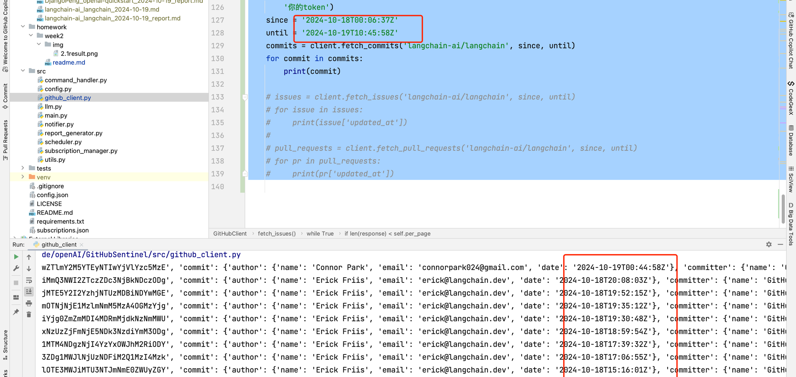

# 2.1作业
链接: https://u.geekbang.org/lesson/656?article=802459

# 2.1作业说明
2.1.1（需要提交）与 ChatGPT 深度对话，尝试使用 System role 提升报告质量和稳定性。fork 项目代码仓库（ https://github.com/DjangoPeng/GitHubSentinel ）之后修改里面的 llm.py 文件，修改好之后同步到自己 fork 后的仓库，然后在下方的作业提交框内提交 fork 后的仓库链接即可。

2.1.2（可选，不需要提交）尝试扩展 GitHubClient，使其支持 Since + Until 参数的特定时间段筛选。


# 2.1.1作业案例
主要是针对 src/llm.py的改造.使用system role 进行修改.
设置system角色.
同时使用基础的RTF+few-shot/one-shot模板进行改造.
```code
# src/llm.py

import os
from openai import OpenAI

class LLM:
    def __init__(self, open_ai_client=None):
        # 支持外部传入client，用于测试
        if open_ai_client is not None:
            self.client = open_ai_client
        else:
            self.client = OpenAI()
        # 包含最基础的RTF模板
        # R: 表示角色
        # T: 表示Task 任务
        # F: 表示格式. 其中的内容可以参考Markdown的格式. 再使用few-shot 等方式给出eg
        self.system_prompt = """
            Role: 你是一个擅长开源项目管理的GitHub Sentinel机器人。
            Task: 你的任务是根据开源项目的最新进展，生成一份简报，以便让团队了解项目的最新动态。
                  用户给你的内容包含了包括commits/issues/pull requests等。
                  你需要根据这些信息，总结一个中文的报告，以项目名称开头，包含"新增功能"、"主要改进"，"修复问题“三个板块。
            Format: 你需要生成**Markdown**格式简报, 格式如下:
            ```
             # [组织] /[仓库名]项目进展
             ## 新增功能
             - [功能描述] (#issue_number)
             - [功能描述] (#issue_number)
             ## 主要改进
             - [改进描述] (#issue_number)
             - [改进描述] (#issue_number)
             ## 修复问题
             - [问题描述] (#issue_number)
             - [问题描述] (#issue_number)
            ```
            请参考下述输出案例:
            ```
             # DjangoPeng/openai-quickstart项目进展
             ## 新增功能
             - 新增作业提交自动对话10次的功能 (#98)
             - 为 openai-translator 添加中文注释 (#60)
             ## 主要改进
             - 将模型从OpenAI更改为ChatGLM2，提高翻译质量 (#102)
             - 对agent代码进行了更新以优化性能 (#111)
             ## 修复问题
             - 修复了requests.exceptions.RequestException和Timeout捕获异常的位置 (#55)
             - 解决了翻译pdf时出现的服务器连接错误 (#87)
            ```
         """

    def generate_daily_report(self, markdown_content, dry_run=False):
        prompt = f"以下是项目的最新进展，{markdown_content}, 请生成简报"
        if dry_run:
            with open("daily_progress/prompt.txt", "w+") as f:
                f.write(prompt)
            return "DRY RUN"

        print("Before call GPT")
        response = self.client.chat.completions.create(
            model="gpt-3.5-turbo",
            messages=[
                {"role": "system", "content": self.system_prompt},
                {"role": "user", "content": prompt}
            ]
        )
        print("After call GPT")
        print(response)
        return response.choices[0].message.content

```
修改完毕上述之后,取消定时执行的注释
src/main.py 39行
安装openai 
```bash
pip install openai
```

执行代码
```bash
python src/main.py
```
执行完结果


# 2.1.2 作业
## 核心思路
1. 通过GitHub API获取指定时间段的commits/issues/pull requests等信息
2. 需要查询github api的文档，找到对应的参数
文档如下
```code
- commits
https://docs.github.com/en/rest/commits/commits?apiVersion=2022-11-28#list-commits
支持since, until
- fetch
https://docs.github.com/en/rest/issues/issues?apiVersion=2022-11-28#list-repository-issues
不支持until
- pull requests
文档: https://docs.github.com/en/rest/pulls/pulls?apiVersion=2022-11-28#list-pull-requests
不支持since, until

上述都支持per_page, page参数
```

3.对于实现since + until参数的特定时间段筛选，通过循环对比时间戳，过滤获取指定时间段的commits/issues/pull requests等信息

## 代码实现
```code
# src/github_client.py

import requests
import datetime
import json


class GitHubClient:
    def __init__(self, token):
        self.token = token
        self.headers = {'Authorization': f'token {self.token}'}
        self.per_page = 5

    def fetch_updates(self, repo, since=None, until=None):
        # 获取特定 repo 的更新（commits, issues, pull requests）
        updates = {
            'commits': self.fetch_commits(repo, since, until),
            'issues': self.fetch_issues(repo),
            'pull_requests': self.fetch_pull_requests(repo)
        }
        return updates

    def fetch_commits(self, repo, since, until):
        commits = []
        page = 1
        until = datetime.datetime.strptime(until, '%Y-%m-%dT%H:%M:%SZ')
        while True:
            # 支持since和until
            response = self._fetch_commits(repo, since=since, until=until, page=page, per_page=self.per_page)
            for commit in response:
                commits.append(commit)
            page += 1
            if len(response) < self.per_page:
                break

        return commits

    def _fetch_commits(self, repo, since=None, until=None, page=None, per_page=None):
        # 文档: https://docs.github.com/en/rest/commits/commits?apiVersion=2022-11-28#list-commits
        # 支持until
        url = f'https://api.github.com/repos/{repo}/commits'
        params = self.get_params(since=since, page=page, per_page=per_page, until=until)
        response = requests.get(url, headers=self.headers, params=params)
        response.raise_for_status()
        return response.json()

    def get_params(self, since=None, page=None, per_page=None, sort="", until=None):
        params = {
            "direction": "asc",
        }
        if since:
            params['since'] = since
        if page:
            params['page'] = page
        if per_page:
            params['per_page'] = per_page
        if until:
            params['until'] = until

        if sort:
            params['sort'] = sort
        return params

    def fetch_issues(self, repo, since, until):
        # 获取特定 repo 的 issues
        issues = []
        page = 1
        until = datetime.datetime.strptime(until, '%Y-%m-%dT%H:%M:%SZ')
        while True:
            print(f"Fetching issues for page {page}")
            response = self._fetch_issues(repo, since=since, page=page, per_page=self.per_page, sort="updated")
            for issue in response:
                # 排序字段是updated_at
                date = issue['updated_at']
                date = datetime.datetime.strptime(date, '%Y-%m-%dT%H:%M:%SZ')
                if date > until:
                    # 携带排序, 可以用break
                    break
                issues.append(issue)
            page += 1
            if len(response) < self.per_page:
                break

        return issues

    def _fetch_issues(self, repo, since=None, page=None, per_page=None, sort=""):
        # 文档: https://docs.github.com/en/rest/issues/issues?apiVersion=2022-11-28#list-repository-issues
        # 不支持until
        url = f'https://api.github.com/repos/{repo}/issues'
        params = self.get_params(since, page=page, per_page=per_page, sort=sort)
        response = requests.get(url, headers=self.headers, params=params)
        response.raise_for_status()
        return response.json()

    def fetch_pull_requests(self, repo):
        # 文档: https://docs.github.com/en/rest/pulls/pulls?apiVersion=2022-11-28#list-pull-requests
        # 不支持since, until
        url = f'https://api.github.com/repos/{repo}/pulls'
        response = requests.get(url, headers=self.headers)
        response.raise_for_status()
        return response.json()

    def export_daily_progress(self, repo):
        date_str = datetime.datetime.now().strftime('%Y-%m-%d')
        since = f'{date_str}T00:00:00Z'
        until = f'{date_str}T23:59:59Z'
        issues = self.fetch_issues(repo, since, until)
        pull_requests = self.fetch_pull_requests(repo)
        filename = f'daily_progress/{repo.replace("/", "_")}_{date_str}.md'
        with open(filename, 'w') as f:
            f.write(f"# {repo} Daily Progress - {date_str}\n\n")
            f.write("## Issues\n")
            for issue in issues:
                f.write(f"- {issue['title']} #{issue['number']}\n")
            f.write("\n## Pull Requests\n")
            for pr in pull_requests:
                f.write(f"- {pr['title']} #{pr['number']}\n")

        print(f"Exported daily progress to {filename}")

        return filename


if __name__ == '__main__':
    client = GitHubClient(
        '你的token')
    since = '2024-10-18T00:06:37Z'
    until = '2024-10-19T10:45:58Z'
    commits = client.fetch_commits('langchain-ai/langchain', since, until)
    for commit in commits:
        print(commit)

    # issues = client.fetch_issues('langchain-ai/langchain', since, until)
    # for issue in issues:
    #     print(issue['updated_at'])
    #
    # pull_requests = client.fetch_pull_requests('langchain-ai/langchain', since, until)
    # for pr in pull_requests:
    #     print(pr['updated_at'])

```

## 执行结果
