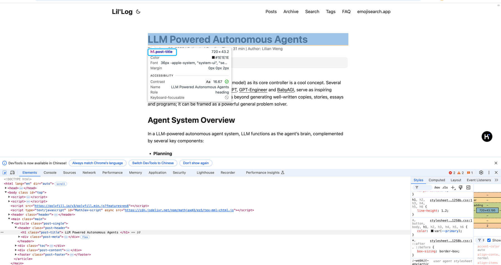
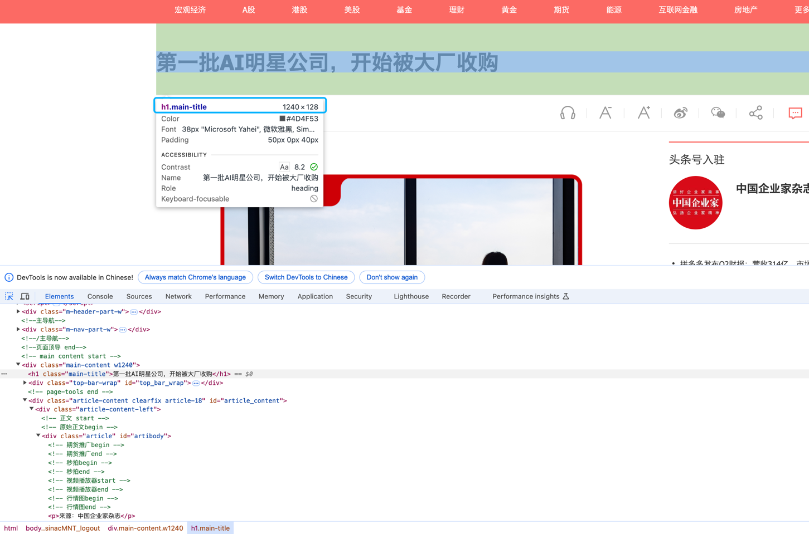
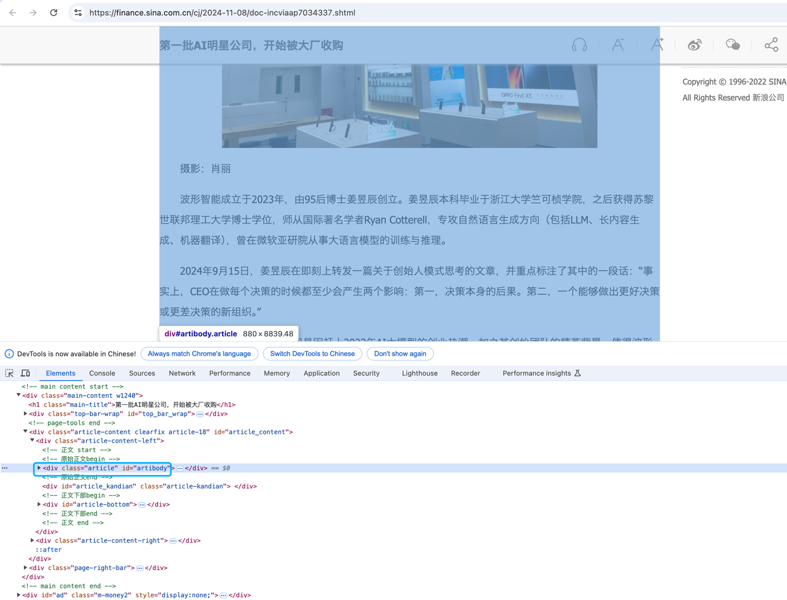

1.
# 作业解析
## LCEL RAG
使用其他的线上文档或离线文件，重新构建向量数据库，尝试提出 3 个相关问题，测试 LCEL 构建的 RAG Chain 是否能成功召回。
重新设计或在 LangChain Hub 上找一个可用的 RAG 提示词模板，测试对比两者的召回率和生成质量。

### 核心思路
1. 通过爬虫的方式抓取指定的class
2. 将这部分抓取的文本转化为向量存储在chroma数据库中
3. 通过RAG模型进行问题的提问
4. 问题的模板使用LangChain Hub上的模板进行对比

### 作业处理
- 使用post-title 的原因
- 通过对原始网页的访问, 发现该网页的标题是在class为post-title的div中
- 其他post-header和post-content的内容也在相应的div中. 需要提前对需要抓取的网页进行css class的分析
- 

- 案例
诸如: 网页 https://finance.sina.com.cn/cj/2024-11-08/doc-incviaap7034337.shtml
使用的是main-title


正文是article

## 结果eg:


### 召回率对比比较简单. 直接访问:
https://smith.langchain.com/hub 选择不同模板测试即可
也可以自己设计模板, 通过RAG模型进行问题的提问


## LCEL Multi-chain（选做）
### 核心思路
主要参考LCEL/multi_chain.ipynb的代码

实现一个多链版本的代码生成，输入功能需求，输出 2 种（Python，Java）以上编程语言的代码实现。

```python
from langchain_openai import ChatOpenAI
chat_client = ChatOpenAI()

# 导入相关模块，包括运算符、输出解析器、聊天模板、ChatOpenAI 和 运行器
from operator import itemgetter
from langchain_core.output_parsers import StrOutputParser
from langchain_core.prompts import ChatPromptTemplate
from langchain_openai import ChatOpenAI
from langchain_core.runnables import RunnablePassthrough

# 创建一个计划器，生成一个关于给定问题的需求
planner = (
    ChatPromptTemplate.from_template("你的代码需求为: {input}")
    | chat_client
    | StrOutputParser()
    | {"base_response": RunnablePassthrough()}
)

# 创建python代码
arguments_for = (
    ChatPromptTemplate.from_template(
        "生成python代码, 需求为:{base_response}"
    )
    | chat_client
    | StrOutputParser()
)

# 创建go代码
arguments_against = (
    ChatPromptTemplate.from_template(
        "生成go代码, 需求为: {base_response}"
    )
    | chat_client
    | StrOutputParser()
)

# 创建最终响应者，
final_responder = (
    ChatPromptTemplate.from_messages(
        [
            ("ai", "{original_response}"),
            ("human", "python代码版本:\n{results_1}\n\ngo代码版本:\n{results_2}"),
            ("system", "直接将上述的代码分类发出即可."),
        ]
    )
    | chat_client
    | StrOutputParser()
)

chain = (
    planner
    | {
        "results_1": arguments_for,
        "results_2": arguments_against,
        "original_response": itemgetter("base_response"),
    }
    | final_responder
)


```

进行提问:
```python
## chain 最终输出经过了 StrOutputParser 处理，所以可以直接输出流式输出 s
for s in chain.stream({"input": "我希望生成快速的算法, 用于排序int数组"}):
    print(s, end="", flush=True)
```